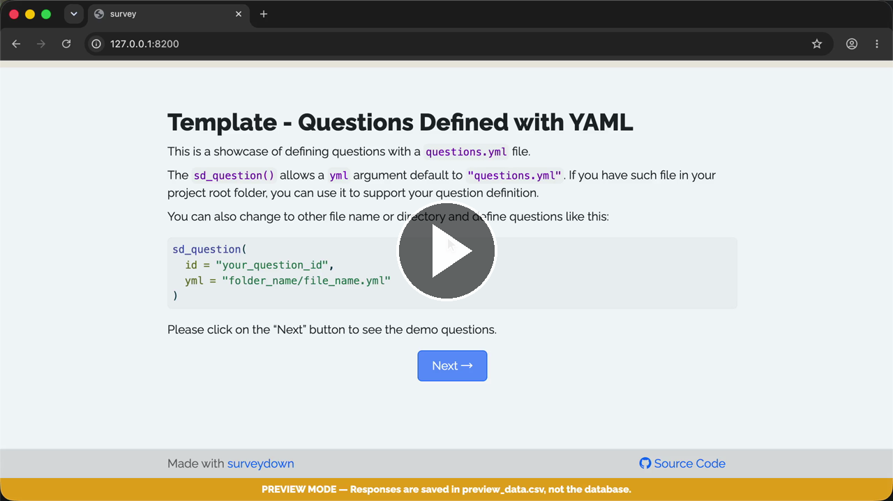

# Template - Questions YAML

A template showcasing all built-in question types using a YAML file.

### See it in action

Watch the **Walkthrough recording:**

[](https://cdn.jsdelivr.net/gh/surveydown-dev/template_questions_yml@main/video-recording.mp4)

### Create this template

Run this command in your R console:

```r
surveydown::sd_create_survey(
  #path = "path/to/survey",
  template = "questions_yml"
)
```

### Learn more

- [Template page - Questions YAML](https://surveydown.org/templates/questions_yml)
- [Document page - Question types](https://surveydown.org/docs/question-types)
- [Document page - Start with a template](https://surveydown.org/docs/getting-started#start-with-a-template)
