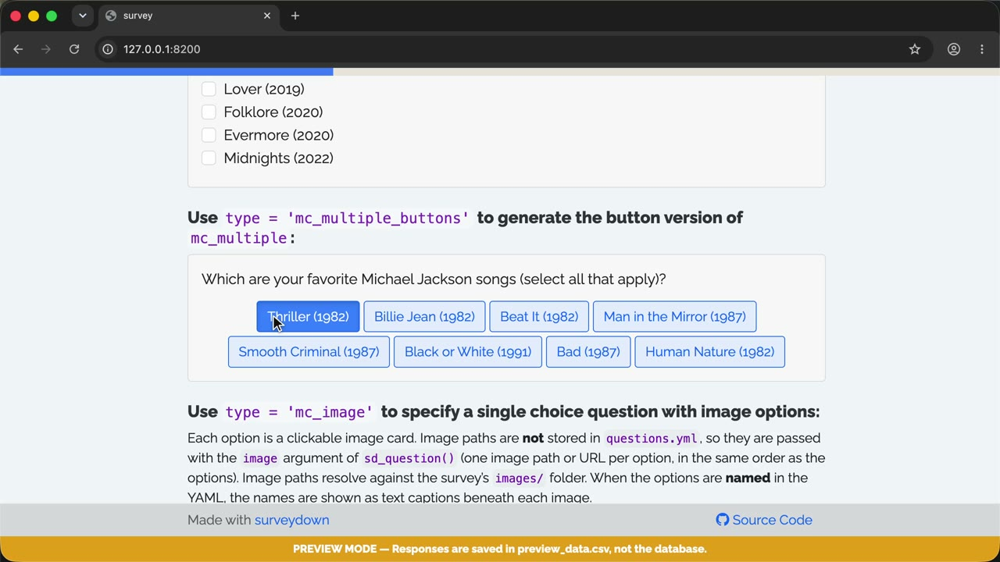

A template showcasing all built-in question types using a YAML file.

### 🎬 Walkthrough Recording

[](https://github.com/surveydown-dev/template_questions_yml/blob/main/video-recording.mp4)

*Click the image above to play the recording.*

### Template page

https://surveydown.org/templates/questions_yml

### Create this template

Run this command in your R console:

```r
surveydown::sd_create_survey(
  #path = "path/to/survey",
  template = "questions_yml"
)
```

### Documentation

[Question types](https://surveydown.org/docs/question-types) · [Start with a template](https://surveydown.org/docs/getting-started#start-with-a-template)
